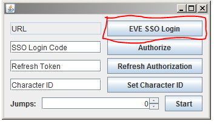
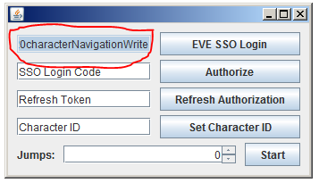
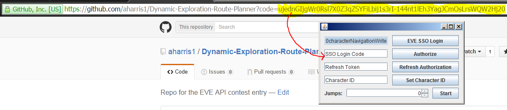
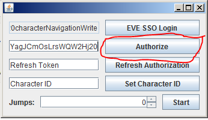
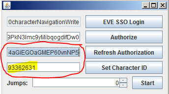
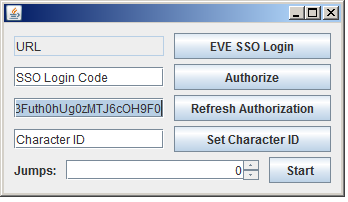
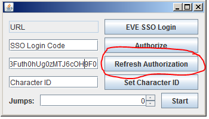
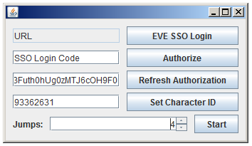
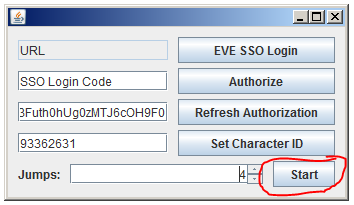
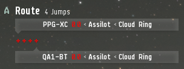

# Dynamic Exploration Route Planner (DERP)

Utilizes data provided by CREST to dynamically plan exploration routes optimised for profit and (relative) safety.

Steps for initial authorization and setup: 
1. Press EVE SSO Login  
2. Copy URL to the left  
3. Login and select character 
4. Enter the code from the URL into the SSO Login Code field  
5. Press Authorize  
6. Copy and save the refresh token  (Save one per character) 

Steps for later authorization and setup: 
1. Paste refresh token into Refresh Token  
2. Press Refresh Authorization  

Steps for use: 
1. Enter desired path length in the spinner  
2. Press start  
3. See waypoints in EVE Client  
4. Fly along waypoints until you reach the end, then repeat from step one. 

Notes about use: 
-Recommended path length is 8 jumps.  Path lengths above 10 tend to take a long time, and 13 tends to cause the program to crash. 
-Once a system is put on a path, the program remembers it and tries not to visit it again.  That effect is reset if the program is restarted.
